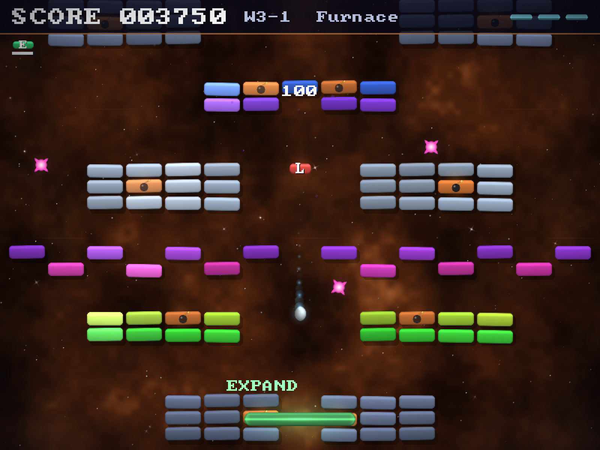

# BREAKUP — a neon arcade classic

A polished, release-ready brick-breaker game written in C with SDL3. All graphics
are generated procedurally at startup (no image assets) and the entire
soundtrack — sound effects, jingles and nine looping music tracks (a menu theme
and a pair per world, which the levels in it alternate between) — is synthesized
in code by a small built-in chiptune engine.



## Features

- **20 hand-designed levels** across 4 themed worlds (Cyan Dawn, Emerald
  Drift, Ember Fields, Violet Void), from single-screen classics to tall
  scrolling towers. Levels are plain text files — easy to edit and mod.
- **7 brick types**: basic, durable (2 hits), tough (3 hits), indestructible
  steel, explosive (chain reactions!), gold bonus bricks, and the crystal —
  destroy all crystals to clear a level.
- **4 enemy types**: drifters that wander the field, divers that hunt your
  paddle, splitters that break into two minis, and saucers that shoot back.
- **9 power-ups**: Expand, Laser, Catch, Extra Life, Multiball, Slow,
  Fireball, Barrier — and the dreaded Shrink.
- **Combo scoring** — chain brick hits without touching the paddle for up to
  a 5× multiplier.
- **Juice**: particles, glow, screen shake, floating score popups, ball
  trails, animated backgrounds with parallax starfields.
- **Full game flow**: animated intro, main menu, level select with unlock
  progression, options (music/SFX volume, fullscreen), high-score table,
  pause menu. Progress and settings persist between sessions.

## Controls

| Input          | Action                                          |
| -------------- | ----------------------------------------------- |
| Mouse / ← →    | Move the paddle                                 |
| Space / Click  | Launch ball, shoot lasers, release caught balls |
| Esc / P        | Pause                                           |
| F              | Toggle fullscreen                               |
| Arrows + Enter | Navigate menus                                  |

## Building

Requires a C17 compiler (`clang` on macOS, `cc` elsewhere), `pkg-config`, and
SDL3 with SDL3_ttf and SDL3_mixer (`brew install sdl3 sdl3_ttf sdl3_mixer` on
macOS). The shipped builds carry their own SDL — see [Releases](#releases).

```sh
make release   # optimized build -> ./breakup
make debug     # debug build     -> ./breakup_dbg
make run       # build debug and run
make clean     # build output only — dist/ is left alone
make distclean # clean, plus the packaged releases in dist/
```

All assets (font + level files) are embedded into the binary by
`embed_assets.sh` during the build, so the executable is self-contained —
`src/assets.c` is the single file that carries them, and `src/embedded_assets.h`
is generated, not checked in.

Builds are parallel-safe (`make -j`) and track header dependencies, so editing a
header or a level file rebuilds what depends on it.

## Releases

`make release` links Homebrew's SDL3, which is arm64-only and built for this
machine's macOS — fine to develop against, useless to anybody else. Every
shipped build is a separate script in `packaging/`, and each one carries its own
copy of SDL so the player installs nothing.

| Target  | Command      | Output                                         | Where it can be built                 |
| ------- | ------------ | ---------------------------------------------- | ------------------------------------- |
| macOS   | `make mac`   | `Breakup-1.0.0-macos.zip`, `Breakup-1.0.0.dmg` | a Mac with a Developer ID certificate |
| Windows | `make win`   | `Breakup-1.0.0-windows-x64.zip`                | any Unix with mingw-w64               |
| Linux   | `make linux` | `Breakup-1.0.0-linux-x86_64.tar.gz`            | Linux only                            |

Everything lands in `dist/`. Two files own the numbers all three read:
`src/version.h` has the version, the app name and the save directory, and
`packaging/sdl3_pins.sh` pins the SDL versions along with the sha256 of every
archive any of the three downloads. Moving a version means editing one line in
one of those, not three scripts.

Neither the Windows nor the Linux payload needs a Mac:
[`.github/workflows/payloads.yml`](.github/workflows/payloads.yml) builds both on
GitHub's runners and attaches them to the run. It starts on nothing but the
button on the Actions tab.

### macOS

```sh
make mac       # -> dist/Breakup-1.0.0-macos.zip and dist/Breakup-1.0.0.dmg
```

It builds a universal (arm64 + x86_64, macOS 11+) binary against the official
SDL3, SDL3_ttf and SDL3_mixer frameworks from libsdl.org, copied into
`Contents/Frameworks`. It then signs the bundle with Developer ID under the
hardened runtime, sends it to Apple's notary service, and staples the ticket into
both the .app and the .dmg. Without that last part macOS tells whoever you send
it to that the app cannot be checked for malicious software and refuses to open
it.

Two things are needed once, on the machine that cuts releases:

- a **Developer ID Application** certificate in the keychain (a paid Apple
  Developer Program membership; it is _not_ the "Apple Development"
  certificate Xcode makes for running on your own devices)
- notarization credentials, stored under a keychain profile:

  ```sh
  xcrun notarytool store-credentials breakup-notary \
      --apple-id <your-apple-id> --team-id <TEAMID> \
      --password <app-specific-password from appleid.apple.com>
  ```

`make mac` fails with instructions if either is missing, rather than quietly
producing a build Gatekeeper will reject.

### Windows

```sh
make win       # -> dist/Breakup-1.0.0-windows-x64.zip
```

Cross-built with mingw-w64 (`brew install mingw-w64`, or `apt install
mingw-w64`), so it runs on the same Mac that cuts the macOS release. There is no
Windows anywhere in `src/` — every include is SDL or the C standard library — so
what a Windows build needs is a compiler that targets Windows rather than a
second project file to keep in step with the makefile.

The zip unpacks to one folder holding `breakup.exe` and the three SDL DLLs it
was linked against. Nothing else: freetype and harfbuzz live inside
`SDL3_ttf.dll`, and `-static-libgcc` keeps the compiler's own runtime out, so the
only thing the player's machine supplies is Windows itself (10 or newer, x64).

The exe is **not** signed with an Authenticode certificate, so Windows will warn
that the publisher is unknown. The payload's `README.txt` says so and points at
this repository.

### Linux

```sh
make linux     # -> dist/Breakup-1.0.0-linux-x86_64.tar.gz
```

The one archive that cannot be cut on a Mac: its SDL is compiled against the
userland it will run on, so the script refuses to start anywhere but Linux. It
builds SDL3, SDL3_ttf and SDL3_mixer from the pinned release tags into
`build/sdl3-linux` (once per pin — it is cached there), then links the game with
an rpath of `$ORIGIN/lib` so the payload finds its own copies wherever it is
unpacked.

SDL_ttf is built with vendored freetype and harfbuzz off, and SDL_mixer with
every decoder that needs an external library off — the game renders Latin text
and synthesizes all of its audio into raw PCM, so neither costs it anything, and
the payload stays at three `.so` files that need nothing installed.

Building SDL needs cmake, git and the X11, Wayland and audio development
headers. `packaging/build_linux.sh` checks for the headers first and names the
missing Debian package in one line, rather than leaving cmake to fail on one
extension at a time. The workflow's `linux` job installs exactly that list.

The glibc floor of the archive is whichever machine linked it — Ubuntu 24.04's
2.39 when it comes out of the workflow, which is why the runner there is pinned
rather than `ubuntu-latest`.

## The store page

```sh
make press     # -> dist/press/ (screenshots, cover, GIFs, wallpaper, MANIFEST.txt)
```

There is no art in this repository to crop for a store page: every pixel is drawn
at runtime, so the only place a picture of this game exists is the back buffer of
a running process. [`tools/press_kit.sh`](tools/press_kit.sh) photographs it
there — fifteen stills at native size and at 2x, four GIFs, the itch.io cover and
a wallpaper — which means the pictures can be _rebuilt_ after a change to the art
instead of being re-photographed by hand and quietly left a version behind.

The game plays itself for it: `BREAKUP_AUTOPLAY` steers the paddle at the ball,
so the captures are real play rather than an idling background. The picture at the
top of this file is one of them — `make press` refreshes it too, so it cannot
quietly end up a version behind the game. Everything else the store page needs,
and what to do with it, is in [`itch/`](itch/README.md).

## Level format

Levels live in `assets/levels/levelNN.txt`. The first `#` line names the
level; every other line is a row of 15 cells:

```
_ empty   B basic   D durable   T tough    S steel (indestructible)
X explosive   G gold   F crystal (the objective)
E drifter   V diver   W splitter   U saucer   (enemy spawn points)
```

Add a `level21.txt` and it shows up in the game automatically.

## Development helpers

Environment variables understood by the binary (useful for testing, and what
`make press` is built out of):

- `BREAKUP_LEVEL=N` — jump straight into level N
- `BREAKUP_STATE=intro|menu|levels|playing|gameover|win` — jump to a screen
- `BREAKUP_AUTOPLAY=1` — the paddle tracks the ball automatically
- `BREAKUP_SHOT=frame:path.bmp` — save a screenshot at a frame, then exit
- `BREAKUP_SHOT_FRAMES=N` — write N frames from there on, `path-0000.bmp` up
- `BREAKUP_SHOT_STEP=K` — keep every K-th frame of that burst
- `BREAKUP_KEYS=frame:scancode,...` — inject key presses (44 is Space, 41 Esc)
- `BREAKUP_SCORE=N` — start with N points
- `BREAKUP_UNLOCKED=N` — pretend N levels have been unlocked (level select)
- `BREAKUP_SEED=N` — seed the RNG instead of the clock

`BREAKUP_SHOT` makes the whole run a **scripted** one, and that is three things
beyond writing a file. It reads and writes no save, so it plays with the settings
the game ships with rather than the ones on this machine — which matters most for
the fullscreen flag, because that is what decides the size the captured frame
comes out at — and it cannot overwrite anybody's progress or high scores. It
advances the world by a fixed 1/FPS step rather than by the wall clock, so a
frame number is a moment in the game and not a moment on the machine. And it
paces itself to nothing at all — no frame cap and no vsync — so a shot deep into
a level costs a fraction of the time that level would take to play. With
`BREAKUP_SEED` on top, two runs of one commit produce byte-identical pictures.

## Credits

The code, the levels, and every pixel and sample the game generates are by
Robert Libšanský. The one asset on disk this project did not write is the font:
**PC Senior** by [codeman38](https://www.zone38.net/font/), a TrueType
conversion of the IBM CGA 8×8 pixel face.

## License

The project is MIT — see [LICENSE](LICENSE). That covers everything here **except
the font**, which is somebody else's work under somebody else's terms; see
[NOTICE.md](NOTICE.md), which also has an open question on it that wants
answering before a public release.
